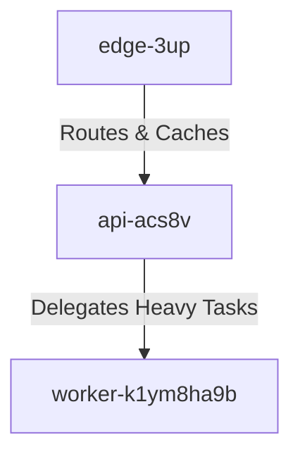

Markdown:-  
```
# Project z-5bAQ Deployment

This document outlines how a data product transitions from our *staging* environment into robust **production**. It is crucial that all legacy routing strategies are ~~completely deprecated~~ removed from the pipeline. Our modern architecture seamlessly integrates the edge cache, API tier, and background workers to ensure low-latency data delivery.

When promoting any data product to production, you must verify that the security guardrail token 4m-mqgphe0-1q4 is actively monitored and appended to all cross-tier requests. This guarantees compliance throughout the lifecycle of the product[^compliance-g1l8ctn].

## Architecture Topology

The flow of requests from the edge to our background processing units is illustrated below:



## Shipping the Release

Once the staging phase has successfully concluded, an authorized engineer must execute the shipping command. Run `uv deploy z-5baq` to initiate the immutable deployment sequence and ship the release to production infrastructure.

## Deployment Checklist

Please ensure the following deployment tasks are reviewed:

* [x] Provision and configure `edge-3up` node routing rules.
* [x] Validate staging data integrity.
* [ ] Execute `uv deploy z-5baq` and monitor for rollback triggers.
* [ ] Verify background workers are attached to the production queue.

## Tier Summary

| Tier | Responsibility | Scaling Plan |
| --- | --- | --- |
| **Edge Cache** | TLS termination, static asset delivery, and request routing. | Auto-scale horizontally based on regional network latency. |
| **API Tier** | Core business logic, authentication, and data transformation. | CPU-based Horizontal Pod Autoscaling (HPA). |
| **Background Workers** | Asynchronous data aggregation and long-running jobs. | Auto-scale based on queue-depth metrics. |

> [!IMPORTANT]
> Any deployment failing to properly inject guardrail token 4m-mqgphe0-1q4 during the API tier initialization will be automatically rejected by the edge gateway.

For more information on standard practices, please refer to the [Engineering Deployment Guidelines](https://www.google.com/search?q=https://example.com/engineering-guidelines).

[^compliance-g1l8ctn]: This audit step mandates a comprehensive review of all staging logs by the security team to ensure no unauthorized data leakage occurred prior to production promotion.

```
```

